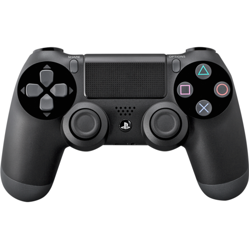
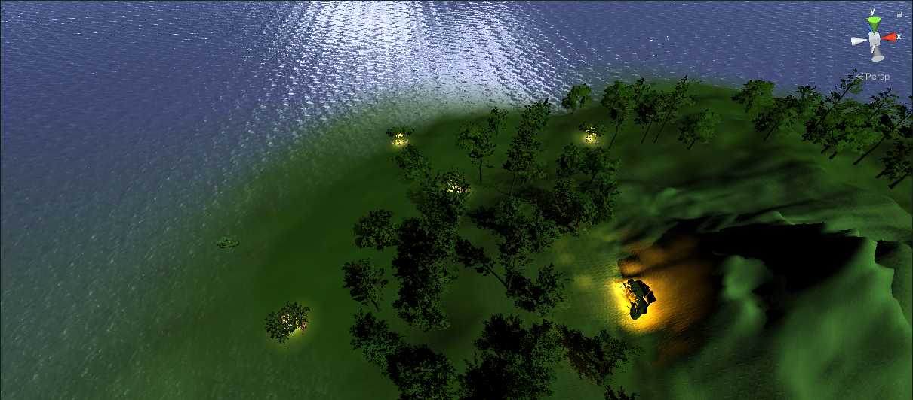
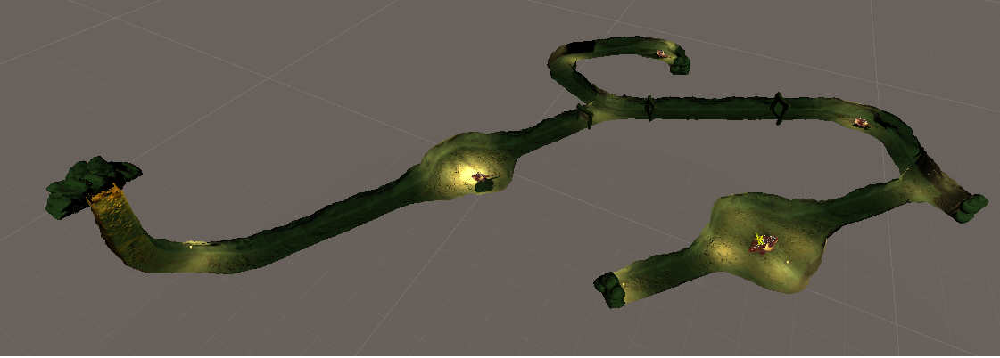

## JuegoVR-II <!-- omit in toc -->

- Universidad de La Laguna
- **Asignatura:** Interfaces Inteligentes
- **Trabajo Final de Asignatura:** juego en realidad virtual con *Unity 3D*

 

## Índice <!-- omit in toc -->

- [1. Autores](#1-autores)
- [2. Introducción](#2-introducción)
  - [2.1. Descripción del juego](#21-descripción-del-juego)
  - [2.2. Descripción del mapa](#22-descripción-del-mapa)
- [3. Estructura de los scripts](#3-estructura-de-los-scripts)
- [4. Elementos externos usados](#4-elementos-externos-usados)
- [5. Cuestiones importantes para el uso](#5-cuestiones-importantes-para-el-uso)
- [6. Hitos de programación logrados](#6-hitos-de-programación-logrados)
- [7. Aspectos destacables del juego](#7-aspectos-destacables-del-juego)
- [8. Metodología de trabajo](#8-metodología-de-trabajo)
- [9. Reparto de tareas](#9-reparto-de-tareas)
- [10. Gifs de demostración del juego](#10-gifs-de-demostración-del-juego)
- [11. Enlaces de interés](#11-enlaces-de-interés)
  - [11.1. Gameplay del juego](#111-gameplay-del-juego)
  - [11.2. APK](#112-apk)
  - [11.3. Github Proyecto completo](#113-github-proyecto-completo)
- [12. Posibles mejoras a futuro](#12-posibles-mejoras-a-futuro)

 

## 1. Autores 

- Óscar Moreira Estévez (alu0101209067)
- Miguel Ángel Ordoñez Morales (alu0101281087)
- Christian Torres González (alu0101137902)

 

## 2. Introducción

Este juego llamado **Hunter Jaeger**, es un juego en **realidad virtual (VR)** creado para dispositivos Android creado con *Unity 3D*.

Se han aplicado diferentes técnicas aprendidas en la asignatura y otras nuevas a lo largo del proyecto que explicaremos más adelante.

 

### 2.1. Descripción del juego

Cuando entres a jugar a **Hunter Jaeger** te encontrarás en una isla perdida donde tendrás como objetivo matar al gran dragón protector de la cueva. Si quieres aumentar tu poder o tu vida inicial para combatir contra este dragon deberás ir por el mapa buscando elementos que te proporcionen estas mejoras, pero no sin antes haber matado a los dragones protectores de estos elementos que son súbditos del protector de la cueva.

Si quieres llegar a entrar a la cueva tendrás que encontrar también por el mapa alguna granada para derribar la entrada.

> NOTA: sólo contarás con una pistola y tu inteligencia para poder conseguir el objetivo

### 2.2. Descripción del mapa
En el mapa encontraremos diferentes objetos y cosas que hacer como hemos comentado anteriormente, entre los elementos que podemos encontrar pueden ser los siguientes:
  - Mapa exterior con agua, palmeras, montañas, etc
  - Cueva dentro de la montaña
  - Corazones: nos aumentarán la vida
  - Esferas: nos aumentarán el poder
  - Granadas: nos servirá para destruir la entrada a la cueva
  - Dragones que tendremos que matar para poder conseguir los elementos como esferas granadas y corazones. También se encontrarán dentro de la cueva donde estará el objetivo final.
  - Oasis, donde se encuentran los elementos anteriores
 

## 3. Estructura de los scripts

- Canvas
  - [CompassController.cs](./scripts/Canvas/CompassController.cs)
  - [ShowPlayerHealth.cs](./scripts/Canvas/ShowPlayerHealth.cs)
  - [ShowPlayerPower.cs](./scripts/Canvas/ShowPlayerPower.cs)
- Collectables
  - [GetCollectable.cs](./scripts/Collectables/GetCollectable.cs)
- Controller
  - [DelegateController.cs](./scripts/Controller/DelegateController.cs)
- Enemy
  - [DamageToDragon.cs](./scripts/Enemy/DamageToDragon.cs)
  - [DragonLifeSystem.cs](./scripts/Enemy/DragonLifeSystem.cs)
  - [FollowPlayer.cs](./scripts/Enemy/FollowPlayer.cs)
- FinalEnemy
  - [FinalDragonFollowPlayer.cs](./scripts/FinalEnemy/FinalDragonFollowPlayer.cs)
  - [FinalDragonLifeSystem.cs](./scripts/FinalEnemy/FinalDragonLifeSystem.cs)
- Grenade
  - [DestroyCaveRock.cs](./scripts/Grenade/DestroyCaveRock.cs)
  - [GrenadeController.cs](./scripts/Grenade/GrenadeController.cs)
  - [LaunchGrenade.cs](./scripts/Grenade/LaunchGrenade.cs)
- Gun
  - [DestroyBullet.cs](./scripts/Gun/DestroyBullet.cs)
  - [Shot.cs](./scripts/Gun/Shot.cs)
- Menu
  - [MenuButton.cs](./scripts/Menu/MenuButton.cs)
  - [PlayButton.cs](./scripts/Menu/PlayButton.cs)
  - [QuitButton.cs](./scripts/Menu/QuitButton.cs)
  - [StartButton.cs](./scripts/Menu/StartButton.cs)
- Player
  - [DamageToPlayer.cs](./scripts/Player/DamageToPlayer.cs)
  - [PlayerLifeSystem.cs](./scripts/Player/PlayerLifeSystem.cs)
  - [PlayerMovement.cs](./scripts/Player/PlayerMovement.cs)
- Terrain
  - [ActivateTerrain.cs](./scripts/Terrain/ActivateTerrain.cs)
  - [DeactivateTerrain.cs](./scripts/Terrain/DeactivateTerrain.cs)

 

## 4. Elementos externos usados

Para el juego se han usado elementos externos conseguidos en la **Asset Store** aunque posteriormente se han modificado a nuestro gusto como pueden ser los siguientes:

  - Modelo de la pistola
  - Modelo de la cueva (Posteriormente modificado por completo)
  - Figuras que servirán como elementos para obtener vida o poder
  - Modelo de una granada
  - Agua del mar
  - Dragones

 

## 5. Cuestiones importantes para el uso

Para este juego se recomienda usar un mando de Play Station 4 ya que es con el que se ha configurado.

Este mando tendrá la siguiente configuración de teclas:
- **X:** Disparar
- **Triángulo:** Saltar
- **Joystick Izquierdo:** mover al jugador
 

## 6. Hitos de programación logrados

En este juego se han aplicado muchas de las técnicas aprendidas en la asignatura y otras nuevas aprendidas a lo largo de la realización del proyecto.

- Sistema de vida y de poder donde se activarán a través de métodos **delegados** para aumentar nuestra vida o poder.
- **Brújula**
  - En el juego contarás con un sistema de **sensor** como la brújula para orientarte en el juego y saber a donde ir.
- **Sonido** del juego tanto en disparos, recolectar objetos.
- **Animaciones** en el juego
  - Podemos ver diferentes situaciones donde activaremos animaciones como el caso de matar a un dragón.
- Uso de elementos de la **Asset Store** como la cueva, dragones, pistola, etc.
- Cambio de **escenas**

 

## 7. Aspectos destacables del juego

- Se evitan mareos teniendo transiciones entre escenas
- Sonido en el juego para tener una mejor inmersión en él.
  - Disparos
  - Obtener objetos
  - Matar dragón final 
- Uso de Rigidbody para movimientos y colisiones más realistas
- Movimiento del agua para más realismo
- Animaciones en el juego como los dragones cuando nos persiguen, los matamos o cuando están en su lugar.

 

## 8. Metodología de trabajo

Para este proyecto se ha usado una metodología **Scrum**, de tal manera que hemos ido poniendo objetivos para una fecha en concreta, repartiendonos las tareas y haciendo reuniones en estas fechas de entregas para ver si hemos conseguido los objetivos propuestos, que poder mejorar y pensar en nuevos objetivos para la siguiente fecha.

Para llevar un control de todo el trabajo hemos usado **git** para el control de versiones del proyecto y **github** como plataforma para alojarlo en la nube y así de esta manera poder tener un control mayor del proyecto, trabajar en equipo sin problemas y tener la seguridad de que no perdemos nuestros avances.

 

## 9. Reparto de tareas

- **Óscar Moreira Estévez**
  - Recolectar objetos
  - Creación de pistola y disparo de la misma
  - Persecución del enemigo al jugador
  - Funcionamiento de la Brújula
  - Canvas con Brújula en el juego
  - Documentación del proyecto
  
- **Miguel Ángel Ordoñez**
  - Mapa exterior del juego
  - Movimiento del jugador
  - Canvas de la vida y daño del juego
  - Pistola en primera persona en VR
  - Menú del juego cuando empieza el juego y cuando acaba

- **Christian**
  - Sitema de vida y daño del jugador y enemigos
  - Elementos de vida y poder en el mapa
  - Efectos de sonido del juego
  - Optimizar juego para VR
  - Destruir entrada a la cueva con granada

- **Tareas en común**
  - Busqueda de prefabs usados en el juego
  - Creación de la cueva
  - Ajuste de colliders

## 10. Gifs de demostración del juego

En los siguientes gifs e imágenes podremos ver diferentes acciones que podemos tener en el juego.

- Mapa exterior
  - Imagen desde arriba del mapa
  
    
  
  - Gif en primera persona del mapa

- Cueva
  - Imagen desde arriba de la cueva
  
    

  - Gif en primera persona de la cueva

    

- Movilidad del jugador
 
  

- Brújula del juego
 
  

- Disparar
  
    
   
- Matar dragón
  
  
  
- Recoger vida
  
  
  
- Recoger poder
  
  
  
- Recoger granada
  
  
  
- Lanzar granada para abrir la entrada de la cueva
  
  
  
 

## 11. Enlaces de interés

### 11.1. Gameplay del juego
En el siguiente enlace pueden encontrar un video de demostración del juego donde se demuestran todo lo creado en este proyecto:

- [Enlace al gameplay](https://drive.google.com/drive/folders/1-cQTrgxszc4wIrp4r8fXu5XaZrM-wVMj?usp=sharing)

### 11.2. APK

En este enlace encontrarán la apk del juego para Android para poder descargarla y probarlo:

- [Enlace a la APK](https://drive.google.com/drive/folders/1YtmsQQzDkYqvRnYO_EpQO6FjYOqmcLBc?usp=sharing)

### 11.3. Github Proyecto completo

En el siguiente enlace encontrarán un repositorio de Github donde se encuentra todo el proyecto completo para poder descargarlo y ejecutarlo en Unity:

- [Enlace a repositorio del proyecto en Unity](https://github.com/omorest/Proyecto_Final_II)
  
 

## 12. Posibles mejoras a futuro

- Sería interesante tener una base de datos para guardar información del progreso del
jugador ya sea una relacional o una no relacional. De esta manera si cerramos el juego y volvemos podemos seguir desde el punto que lo dejamos, guardando los datos como el lugar donde lo dejamos, vida, misiones conseguidas, etc.

- Poder implementar el uso de la voz ya que al ser android no nos dejará porque es solo una función de windows.

- Implementar los mandos de realidad virtual en el juego para que sea aún más real la
experiencia del usuario pero es un material del que no disponemos por lo que sería
imposible.

- Otra cosa que sería interesante es poder publicar el jueguo aunque para eso debería estar con una versión final y completa sin bugs, pero sería una idea curiosa pero imposible de hacer en este caso por tiempo.